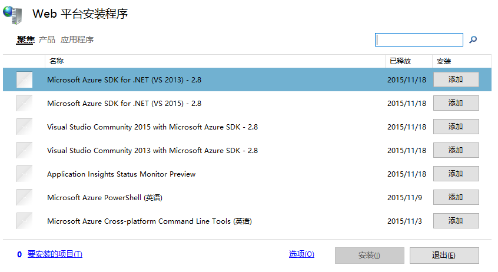
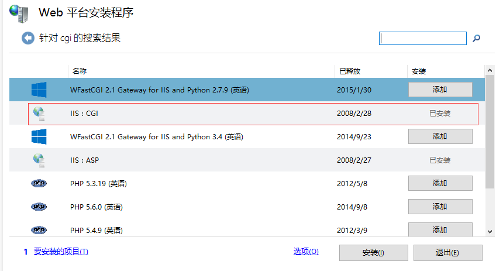
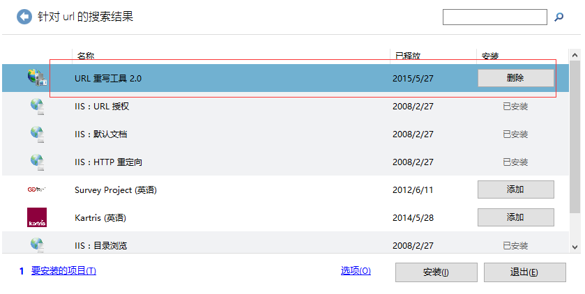
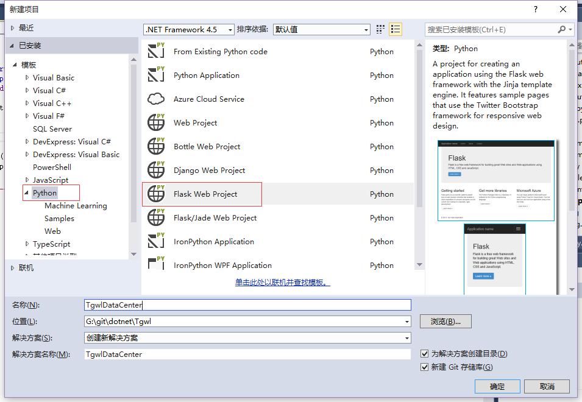

本文介绍了如何在Windows上部署Python Flask应用，相关环境如下：
- 操作系统：windows 7
- Python：3.4
- WFastCGI: 2.2
应用所用到的包版本如下：
```
Flask==0.10.1
Flask-SQLAlchemy==2.1
itsdangerous==0.24
Jinja2==2.8
MarkupSafe==0.23
pyodbc==3.0.10
SQLAlchemy==1.0.9
Werkzeug==0.11.2
wheel==0.24.0
```

##1. WFastCGI
wfastcgi.py使用WSGI和FastCGI提供了IIS和Python之间的桥接，类似于Apache HTTP服务器上的mod_python.

它能够用于任何支持WSGI的Python web应用或者框架，而且提供了IIS处理请求和进程池的高效方法。
##2. 安装
###2.1 下载安装包

通过PyPI安装：
```
pip install wfastcgi
```

###2.2 IIS安装FastCGI和URL重写

IIS需要安装FastCGI和URL重写，这个可以通过[Microsoft Web Platform Installer](https://www.microsoft.com/web/downloads/platform.aspx)来安装。下载过[Microsoft Web Platform Installer](https://www.microsoft.com/web/downloads/platform.aspx)点击运行，会出现如下的界面。


在搜索栏分别输入cgi和url重写，点击添加按钮：




**注**：windows10上的IIS 10现在不支持url重写。


##3. 启用wfastcgi

一旦`wfastcgi`和IIS安装完毕，用管理员的身份运行`wfastcgi-enable`来在IIS上启用`wfastcgi`配置。这个能配置一个[路由处理器](#routehandlers)的CGI应用。

```
wfastcgi-enable
```

要在卸载之前禁用`wfastcgi`，运行`wfastcgi-disable`：

```
wfastcgi-disable
pip uninstall wfastcgi
```

**注意**: 卸载`wfastcgi`不会自动的取消注册CGI应用。

如果传递给`wfastcgi-enable`或者`wfastcgi-disable`的第一个参数是一个有效的文件，整个命令行就用来注册或取消注册这个CGI处理器。

例如，下面的命令就是在IIS Express上启用wfastcgi，而且指定主机配置。

```
wfastcgi-enable "C:\Program Files (x86)\IIS Express\appcmd.exe"
    /apphostconfig:C:\Path\To\applicationhost.config
```

你也可以使用`wfastcgi-disable`来禁用相同配置的wfastcgi:

```
wfastcgi-disable "C:\Program Files (x86)\IIS Express\appcmd.exe"
    /apphostconfig:C:\Path\To\applicationhost.config

```

##4. 使用PTVS创建Python Web项目

[PTVS](https://github.com/Microsoft/ptvs/wiki/PTVS-Installation)是Visual Studio的一个插件，能够让VS支持Python开发，下载并安装后，就可以使用它来开发Python项目了。
使用PTVS创建一个Flask项目（Django项目类似）：


PTVS会自动根据模板创建一个项目，点击运行，就会在项目根目录下创建一个web.config文件。我在下面对文件进行了一些修改说明。

```
?xml version="1.0"?>
<configuration>
  <system.diagnostics>
    <!--如果不用此节点可以移除-->
  </system.diagnostics>
  <appSettings>
    <add key="WSGI_ALT_VIRTUALENV_HANDLER" value="TgwlDataCenter.app" /><!--value指定Flask实例，PTVS会自动生成，也可以自己定义-->
    <add key="WSGI_ALT_VIRTUALENV_ACTIVATE_THIS" value="%ROOTDIR%\env\Scripts\activate_this.py" /><!--value指定激活虚拟路环境用到的内容-->
    <add key="WSGI_HANDLER" value="ptvs_virtualenv_proxy.get_virtualenv_handler()" /><!--也是虚拟路径的WSGI_HANDLER，不用修改-->
    <add key="PYTHONPATH" value="%ROOTDIR%" /><!--项目根目录-->
  </appSettings>
  <system.web>
    <compilation debug="true" targetFramework="4.0" />
  </system.web>
  <system.webServer>
    <modules runAllManagedModulesForAllRequests="true" />
    <handlers>
      <add name="Python FastCGI" path="handler.fcgi" verb="*" modules="FastCgiModule" scriptProcessor="%INTERPRETERPATH%|%WFASTCGIPATH%" resourceType="Unspecified" requireAccess="Script" /><!--scriptProcessor的值就是你在运行wfastcgi-enbale时输出的值-->
    </handlers>
    <rewrite>
      <rules>
        <rule name="Static Files" stopProcessing="true">
          <match url="^/static/.*" ignoreCase="true" /><!--静态文件不用CGI处理，直接使用IIS返回静态文件-->
          <action type="Rewrite" url="^/TgwlDataCenter/static/.*" appendQueryString="true" />
        </rule>
        <rule name="Configure Python" stopProcessing="true">
          <match url="(.*)" ignoreCase="false" />
          <conditions>
          </conditions>
          <action type="Rewrite" url="handler.fcgi/{R:1}" appendQueryString="true" />
        </rule>
      </rules>
    </rewrite>
  </system.webServer>
</configuration>
```

`scriptProcessor`的值是`wfastcgi-enable`命令执行时输出的，不同机器值也不一样。`path`和`verb`的值也可以进一步自定义来限制request的类型。

`name`值可以在子文件夹的`web.config`文件中使用，来屏蔽handler的作用。比如，在`/static`子文件夹中添加一个`web.config`文件，包含`<remove name="Python FastCGI"/>`来阻止IIS通过Python应用来解析静态文件。

app setting被转换为环境变量，并且能够在Python应用中通过`os.getenv`来获取。下面这些变量由`wfastcgi`使用。

**注意**：部署时需要将`%ROOTDIR%`全部替换为项目根目录，`%INTERPRETERPATH%|%WFASTCGIPATH%`替换为`wfastcgi-enable`命令执行时输出，我的是`C:\Python34\python.exe|C:\Python34\lib\site-packages\wfastcgi.py`

此时，将项目部署到IIS上就可以了，创建方法同普通的ASP.NET网站创建方法相同。

作者：liulixiang1988#gmail.com (#换成@)
